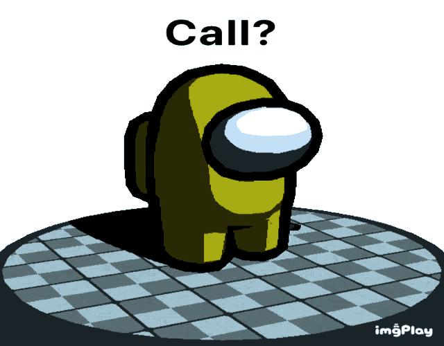
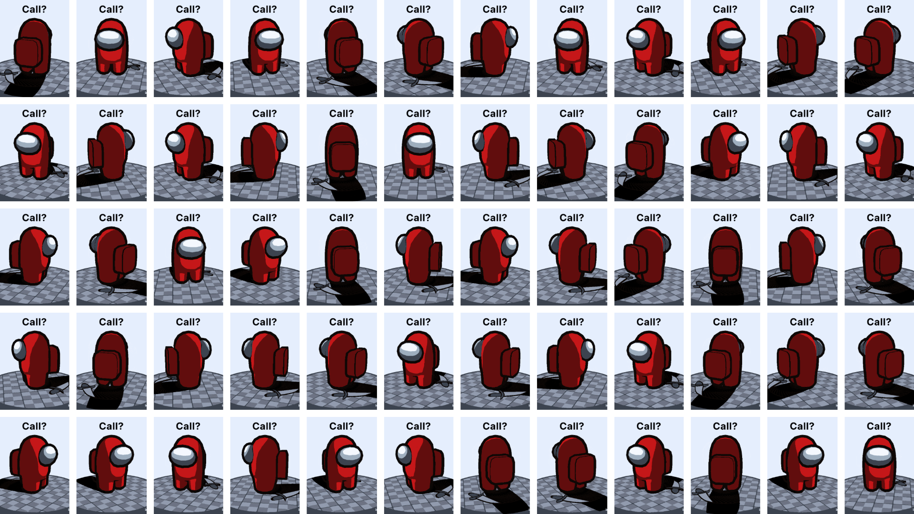

# 圖片魔法師

## 組員: 01057001 王家騏 01057020 林佑丞

<a href="https://youtu.be/Tn8__hfTPU0"></a>

## 功能
1. 圖片濾鏡

| 原圖 | 結果 |
| -------- | -------- |
||

2. 圖片合成

| 圖A | 圖B | 橫向結果 | 直向結果
| -------- | -------- | -------- | -------- | 
|  |  |  | 
3. Gif

| 原始Gif | 逆轉Gif |
| -------- | -------- |
|  | 

| 圖片合成Gif | 輸出Gif |
| -------- | --------- |
|  | 

Gif逐幀轉圖片則是將Gif轉換成圖片


## Run:
1. 請先將所有Java檔案都編譯過
```cmd
javac -encoding utf-8 -d . GifMod/*.java Filter/*.java Gif/*.java Mix/*.java *.java
```
2. 執行
```cmd
java ClassPackage.PhotoMagician
```

## News

[2023/6/5] 改用繼承語法實作濾鏡

## Issue

[2023/6/5] jar檔中，gif預覽無正常顯示
